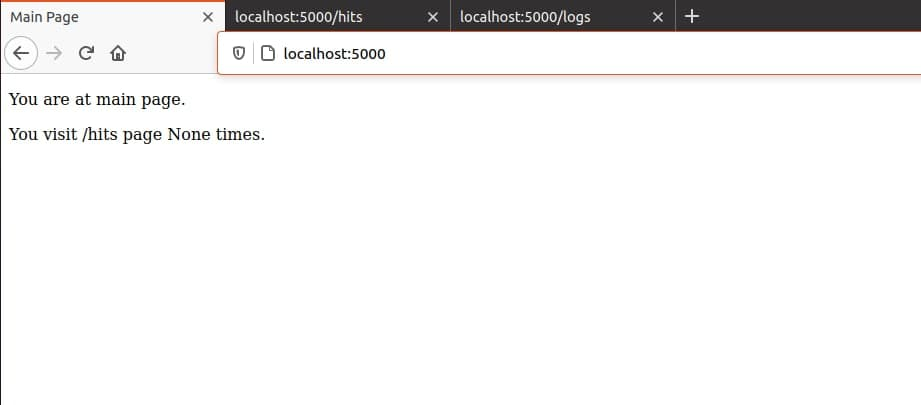
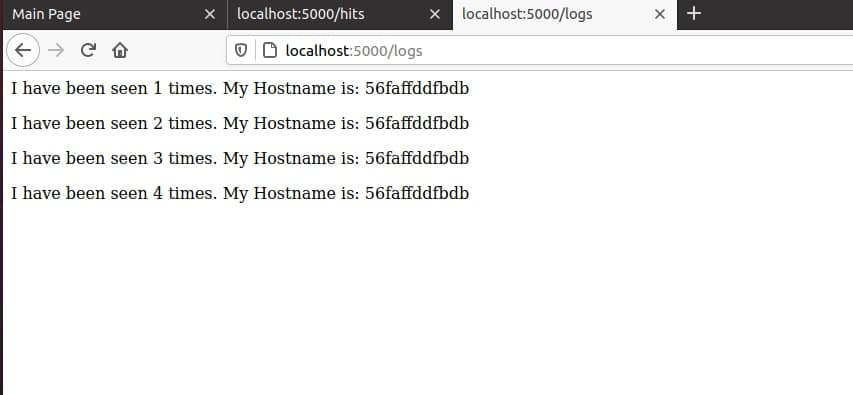
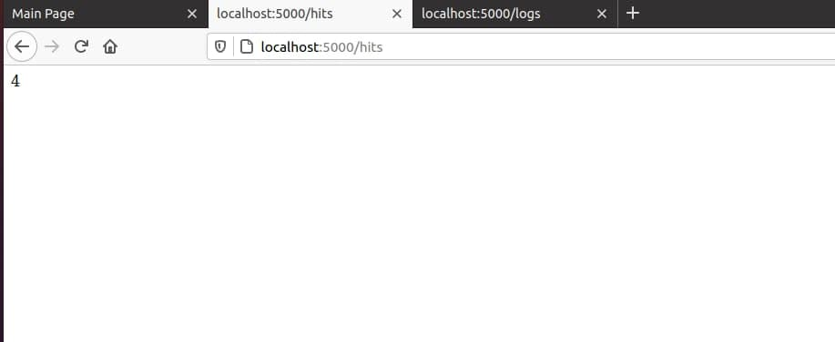

### Lab5    

**1**
I have learnt about docker-compose

**2**
I have learnt about Flask

**3**
I have learnt about YAML format

**4**
I have created empty project empty directory

**5**
Created my_app and tests directories for project and fot unit tests. In project using flask and redis packages. In unit test using pytest and requests packages.

**6**
I have run app.py, checked if project is working and run tests.
During the running i met some fails such a problem with Redis and problem with logs directory.
After resolving web pages started work well.

**7**
Deleted Pipfiles. Created Dockerfiles and Makefile for app, unit tests and for deploying.

**8**
Makefile has some rules
#app - run docker build for the Dockerfile.app
#tests - run docker build for Dockerfile.tests
#test-app - run test-app container
#run - create network for docker container and run redis and app containers too.
#docker-prune - removes and cleans unused containers, networks, volumes, images

**9**
Build and run app. Web pages work well




**10**
Cleaned all resources in project using

```
make docker-prune
```

**11**
Created pushing images to the Dockerhub
```
docker-push:
	@docker push $(REPO):app \
	&& docker push $(REPO):tests
```

**12**
Created rule witch delete images
```
images-delete:
	@sudo docker image rm --force $(shell sudo docker images -q)
```

**13**
Created docker-compose.yml

**14**
Run docker-compose using
```
sudo docker-compose up
```

**15**
Web page works well on port 
```
localhost:80
```

**16**
docker-compose has created image


**17**
Stoped docker-compose using 
```
sudo docker-compose down
```

**18**
I have pushed images to thed DockerHub using
```
sudo docker-compose push
```

**19**
In my opinion docker-compose is better for using. This way is more for docker context and do more docer functions.

**20**
I have created docker-compose for Lab4 of Django project in Lab4 folder. After complitting Django and monitoring started well.

**21**
Created README file and created pull request