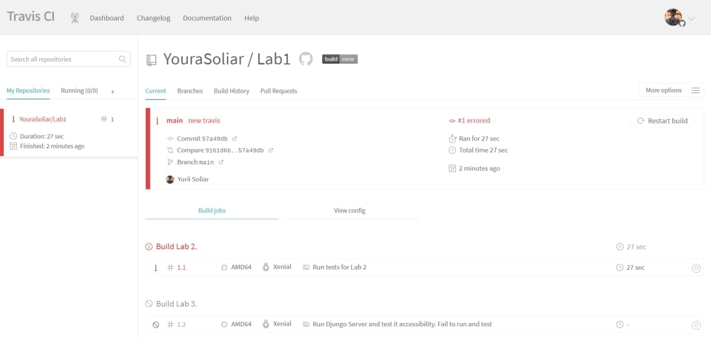
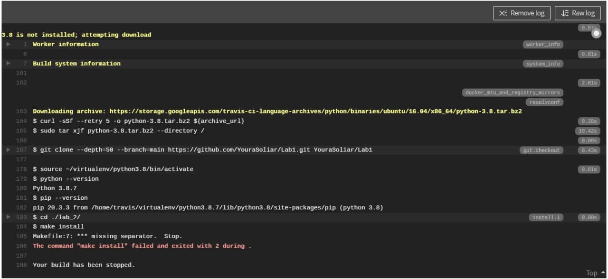
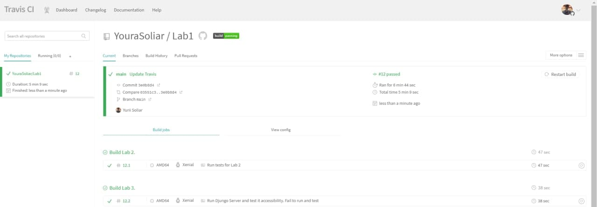

### Lab6

**1**
Registered in Travis CI and added my repo into the Trevis 

**2**
Learnt about Travis in documentations

**3**
Add .travis.yml file

**4**
Travis CI build started and errored

**5**
Found decision for all bugs and Travis has successfully done all jobs

**6** 
Travis IC build
* Lab2 updated Makefile 
* Lab3 updated monitoring.py
* Lab4 updated Dockerfile.site
* Lab5 updated Makefile

**7**
Travis CI build https://travis-ci.com/github/YouraSoliar/Lab1